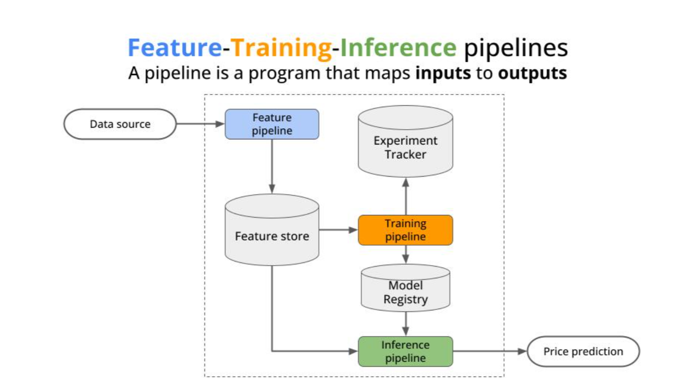
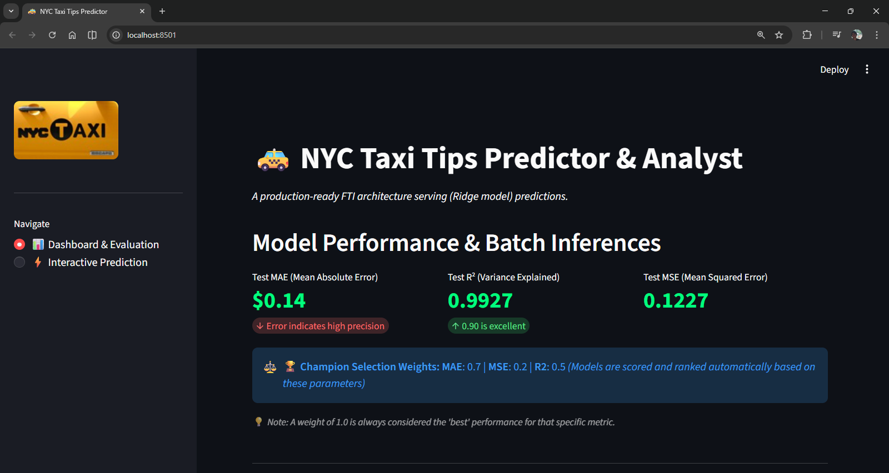
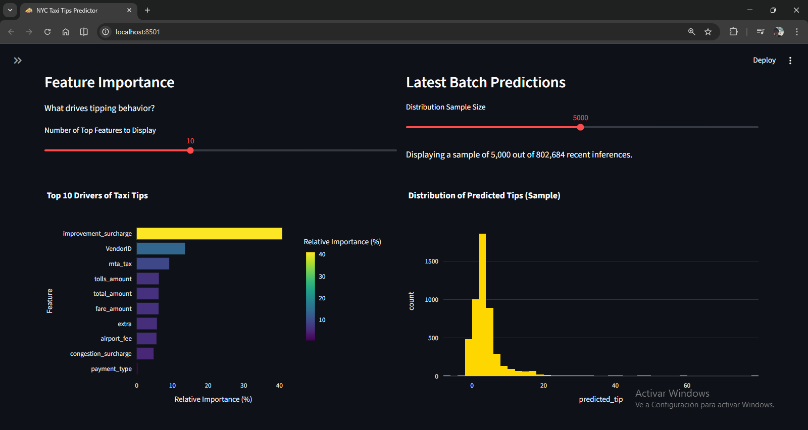
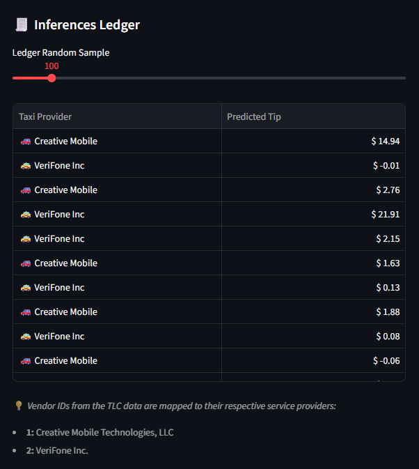
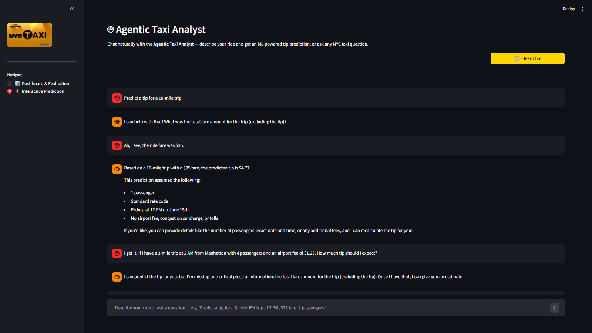

<div align="center">
  
  
  
  
  
  
  
  
  
  
  <h1>🚕 NYC Taxi Tip Prediction System 🚕</h1>
  <p><strong>A Production-Grade Agentic MLOps System implementing the strict FTI (Feature, Training, Inference) Pattern</strong></p>
</div>

---

## 📖 Executive Summary
The **NYC Taxi Tip Prediction System** is a robust Machine Learning solution designed to predict tip amounts for NYC Yellow Taxi rides. By systematically analyzing over **5 million recorded trips**, the system identifies the key drivers of tipping behavior, translating raw data into actionable revenue optimization insights for Fleet Managers.

Moving away from exploratory "notebook thinking," this project embodies the **Agentic Data Scientist** mindset by strictly decoupling data engineering from model development using the modular **FTI (Feature, Training, Inference)** architecture.

---

## 🏗️ Architecture: The FTI Pattern
To ensure massive scalability, strict reproducibility, and readiness for batch production workloads, the system is architected into three distinct, independently operational pipelines:

<div align="center">
  
</div>
<br>

1. 🔵 **Feature Pipeline (Data Engineering):** Transforms raw, messy taxi logs into a pristine Feature Store. It manages missing values, prunes anomalies (e.g., negative fares, impossible distances), and intelligently engineers cyclical temporal features (Hour/Day/Month) via chunked or native Polars processing to securely handle massive datasets out-of-core.
2. 🟠 **Training Pipeline (Model Development):** Operates on the engineered features to evaluate and identify the best predictive model. It actively utilizes **Temporal Splitting** (preventing disastrous look-ahead bias), benchmarks multiple algorithms simultaneously (XGBoost, Random Forest, Ridge, etc.), and cleanly registers the ultimate Champion Model using **MLflow**.
3. 🟢 **Inference Pipeline (Model Serving):** A standalone batch prediction engine that applies the frozen Champion Model to fresh, unseen holdout data. Deployed natively as a **FastAPI** microservice, decoupling compute from rendering.
4. 🤖 **Agentic Tool Abstraction:** A strict, deterministic Python interface built on top of the serving layer. Utilizing Pydantic for rigid input validation and custom exceptions for "Agentic Healing," it allows Large Language Models (LLMs) to natively integrate with the ML pipeline to orchestrate predictions.

---

## 🔀 Pipeline Orchestration (DVC)

The entire MLOps lifecycle is governed seamlessly by **Data Version Control (DVC)** as a Directed Acyclic Graph (DAG). Data artifacts and intermediate states are heavily versioned without bloating Git, meaning the predictive process is 100% auditable and reproducible.

*   `stage_01_data_ingestion`: Joins massive trip data parquets with spatial lookup tables.
*   `stage_02_data_validation`: Checks structural data quality (schema enforcement).
*   `stage_03_data_transformation`: High-performance imputation and filtering heuristics.
*   `stage_04_feature_engineering`: Temporal splitting and cyclical feature extraction converting times to `sin`/`cos` vectors across `train`, `val`, and `test` clusters.
*   `stage_05_model_trainer`: Model searching, multi-metric candidate ranking, and Joblib Champion extraction.
*   `stage_06_model_evaluation`: Scoring the actualized champion model against the test set and logging all telemetry insights.

---

## ️ Interactive Dashboard

Bridging the gap between the complex backend and business stakeholders, a native **Streamlit Interactive Application** serves insights directly, consuming pre-computed artifacts. 

<div align="center">
  <h3>📊 Dashboard & Evaluation</h3>
  <p>Dedicated to high-level analytics, model transparency, and offline batch prediction reviews.</p>
  
  <br><br>
  
  <br><br>
  
  <br><br>
  <h3>🤖 Interactive Prediction</h3>
  <p>Allows users to simulate taxi rides and query the champion model in real-time, focusing on a frictionless batch-input experience.</p>
  
</div>
<br>

* **Performance Validation:** Easily review Test MAE, Test MSE, R², and the internal custom weights utilized during automated model selection.
* **Global Explanation:** Explore global visual Feature Importance charts dynamically extracted directly from the champion model to identify what precisely drives high tipping behavior.
* **Live Inferences:** Users can manage rides natively in a rich interactive table (`st.data_editor`), insert new simulated samples, and seamlessly run them through the loaded model artifact for instant real-time inference forecasting.

---

## 🧪 Testing & Quality Assurance
The codebase actively emphasizes "Testing Logic, not external Libraries," relying on `pytest`.
* **Component Tracking**: Robust unit test coverage of logic gates across Ingestion, Transformation, Feature Engineering, and Model Training steps.
* **Mock Handling**: Replaces massive physical disk reads with instantaneous in-memory `Polars` test fixtures for blazing-fast `pytest` assertions.
* **Safeguards**: Specific edge-case traps evaluated extensively (e.g., zero distance handling, negative fares prevention, Temporal Data Leakage boundaries).

---

## 🛠️ Technology Stack

| Category | Tool | Justification |
| :--- | :--- | :--- |
| **Package Manager** | **uv** | Blazing fast deterministic dependency resolution in purely clean Python environments. |
| **Orchestration** | **DVC** | Connects DAG pipeline stages and versions massive immutable parquet artifacts securely. |
| **Data Engine** | **Polars / Pandas** | High-performance feature manipulation and mutation avoiding standard OOM complications. |
| **Experiment Tracking**| **MLflow** | Unobtrusive offline hyperparameter logging and local Model Registry governance. |
| **Testing** | **Pytest** | Component-level behavior and logic evaluations. |
| **Web Interface** | **Streamlit** | Rapid presentation layer displaying evaluation metrics and live inference engines. |
| **Microservice** | **FastAPI** | High-performance, asynchronous REST API serving machine learning inferences reliably. |
| **Containerization**| **Docker** | Encapsulates the frontend and backend services into isolated, reproducible execution environments. |
| **CI/CD** | **GitHub Actions**| Automates deterministic unit testing and code quality (Ruff) gating on every push. |

---

## � Setup & Execution

### 1. Installation Environment
This project rigorously depends on modern `uv` dependency management for lightning-fast setup. 
```bash
# Clone the repository
git clone https://github.com/SebastianGarrido2790/nyc-taxi-tips-prediction.git

cd nyc-taxi-tips-prediction

# Sync packages and dependencies entirely using uv
uv sync --all-extras
```

### 2. DVC Pipeline Execution
Trigger the reproduction of the entire DAG. DVC automatically detects what code or data components have changed and runs only the minimum required compute:
```bash
# Initialize and pull remote data assets (if remote storage is configured)
uv run dvc pull

# Execute end-to-end Pipeline Lifecycle seamlessly
uv run dvc repro
```

### 3. Environment Configuration
Create a `.env` file in the root directory to define the MLflow tracking URI and API configurations. Example `.env`:
```env
# Define the environment (local/staging/production)
ENV=local

# FTI ARCHITECTURE PATHS
# Frontend API reference. For local development, use localhost.
# In Docker, `docker-compose.yml` automatically overrides this to `http://backend:8000`.
API_URL=http://localhost:8000

# MLFLOW TRACKING CONFIGURATION
# Set to remote host URL, network-based tracking (http://127.0.0.1:5000), or local file-based:
MLFLOW_TRACKING_URI=file:./mlruns
```

### 4. Launching the App (Local Dev)
Interact natively with the trained artifacts using the Streamlit visual dashboard.

**Option A - Automated Launch (Windows)**:
You can rapidly spin up both the FastAPI backend and Streamlit frontend using the provided batch script:
```cmd
.\launch_app.bat
```

**Option B - Manual Launch**:
Run the backend and frontend simultaneously in separate terminals:
```bash
# Start the FastAPI backend
uv run uvicorn src.api.predict_api:app --reload --port 8000

# Start the Streamlit frontend (in a new terminal)
uv run streamlit run app.py
```

### 5. Production Deployment (Docker Compose)
Launch the entire system inside isolated, network-meshed containers:
```bash
# Build and spin up the services
docker-compose up --build -d

# The Streamlit dashboard is now live at http://localhost:8501
# The FastAPI Swagger docs are live at http://localhost:8000/docs
```

<br>
<div align="center">
  <i>Developed applying the <b>MLOps Stack Principles</b> for Professional Agentic Data Science</i>
</div>
