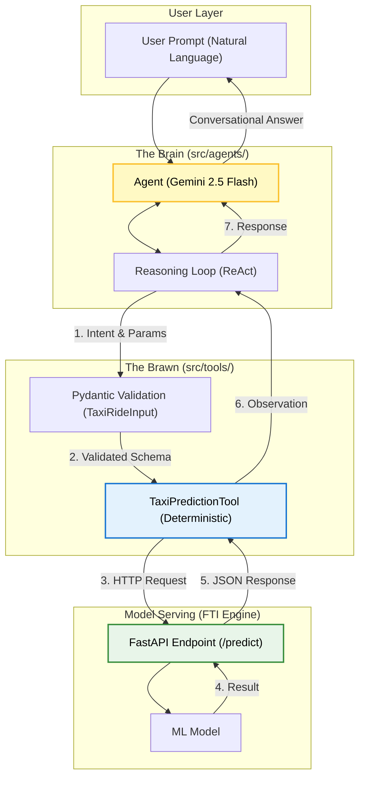

# Agentic Workflow Report: Natural Language Taxi Analyst

## 1. Objective
The goal of this phase was to transform the "Interactive Prediction" system (Page 2) from a static, form-based input (`st.data_editor`) into a conversational **Natural Language Chat UI**. This allows users to describe ride scenarios in plain English, which are then autonomously parsed and executed by an AI Agent.

## 2. The ReAct Pattern (Reasoning + Acting)
We implemented the agent using the **ReAct (Reason + Act)** pattern via LangGraph's `create_react_agent`.

### 2.1 Why ReAct?
Traditional LLM integration often follows a "one-shot" approach where the model tries to guess everything at once. ReAct provides an iterative loop:
1.  **Reason**: The LLM analyzes the user prompt and thinks about what information it's missing or what tool it needs.
2.  **Act**: The LLM calls a deterministic tool (e.g., `predict_taxi_tip`).
3.  **Observe**: The LLM sees the tool's output (the prediction or an error).
4.  **Repeat/Respond**: The LLM either asks for more info or provides the final answer.

**Strategic Benefit**: ReAct makes the system significantly more robust. If a user provides incomplete data (e.g., "Predict a tip for a 5-mile trip"), the Agent can *reason* that the pickup hour is missing, *ask* the user for it, and only then *act* by calling the prediction tool.

### 2.2 Workflow Visualization

## 3. Implementation Details

### 3.1 The "Brain": Google Gemini 2.5 Flash
*   **Model**: `gemini-2.5-flash`
*   **Configuration**: `temperature=0.0` for maximum determinism in tool selection and parameter extraction.
*   **Role**: Serves as the orchestrator that parses intent and maps natural language to the `TaxiRideInput` schema.

### 3.2 The Workflow: LangGraph
Instead of a linear script, we used **LangGraph** to define a stateful agentic graph:
*   **State Management**: The conversation history is maintained, allowing the user to provide details across multiple messages.
*   **Tool Binding**: The `predict_taxi_tip` tool (our "Brawn") is bound directly to the LLM's capability set.

## 4. UI Transformation: Interactive Prediction Upgrade
We replaced the manual `st.data_editor` with a modern Streamlit Chat interface.

| Feature | Old (Static Form) | New (Agentic Chat) |
| :--- | :--- | :--- |
| **Input Method** | Manual cell editing | Natural Language typing |
| **Validation** | Hard-coded field limits | LLM reasoning + Pydantic enforcement |
| **Error Handling** | Generic app crashes | "Agentic Healing" (The AI explains the error) |
| **Scalability** | Fixed schema | Supports complex queries (e.g., "Check multiple trips") |

## 5. Conclusion
By upgrading to an Agentic Workflow with the ReAct pattern, the NYC Taxi Tips Prediction system has evolved from a simple calculator into an intelligent **Decision Support System**. It bridges the gap between complex ML outputs and accessible business insights.
