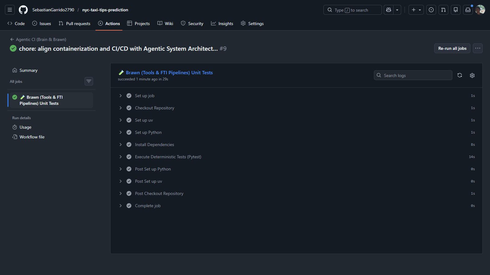

# Phase 6.1: Deployment - Agentic Docker Containerization Report

## 1. Objective
The goal of Phase 6.1 was to containerize the NYC Taxi Tips Prediction application as part of the deployment process. This involved taking the decoupled architecture established in Phase 5 (FastAPI backend and Streamlit frontend) and encapsulating it within isolated, reproducible Docker containers. Finally, these containers were orchestrated to run seamlessly together using Docker Compose.

## 2. Agentic Docker Architecture (Brain vs. Brawn)
 
The architecture adheres strictly to the **Agentic System Architect** principles, decoupling the system into two distinct microservices that communicate via a bridge network:
*   **The Brain (Frontend)**: Handles probabilistic reasoning and the LangGraph workflow.
*   **The Brawn (Backend)**: Handles deterministic ML inference and FTI logic.

### 2.1 Base Images & `uv` Optimization
Both Dockerfiles utilize the `ghcr.io/astral-sh/uv:python3.11-bookworm-slim` base image.
*   **Why `uv`?** `uv` is an extremely fast package manager written in Rust. By using this image, we leverage `uv sync --frozen` to ensure deterministic, reproducible builds that install dependencies orders of magnitude faster than standard `pip`.
*   **Why `slim`?** The `bookworm-slim` variant removes unnecessary operating system packages (like compilers and curl), drastically reducing the final image footprint and attack surface.

### 2.2 The Brawn: Backend Container (`docker/backend.Dockerfile`)
*   **Purpose:** Hosts the FastAPI inference server.
*   **Payload:** Copies only the necessary code (`src/`, `config/`), lockfiles, and the trained model/metadata (`artifacts/`).
*   **Execution:** Runs `uvicorn` on port `8000`. It acts as the deterministic execution layer for the Agent.
 
### 2.3 The Brain: Frontend Container (`docker/frontend.Dockerfile`)
*   **Purpose:** Hosts the Streamlit interactive dashboard and the LangGraph Agentic Analyst.
*   **Payload:** Copies the UI code (`app.py`), agents (`src/agents/`), tools, and reports.
*   **Execution:** Runs `streamlit run app.py`. It orchestrates the ReAct pattern using Gemini-2.5-flash.

## 3. Orchestration Details (`docker-compose.yml`)

The `docker-compose.yml` file acts as the maestro, bringing both images online and wiring them together securely.

| Service | Configuration Highlight | Purpose |
| :--- | :--- | :--- |
| **Network** | `nyc-taxi-net` (bridge) | A private network allowing the "Brain" and "Brawn" to communicate securely. |
| **Backend** | `healthcheck` via `python urllib` | Ensures the model is loaded before the agent starts requesting predictions. |
| **Frontend** | `GOOGLE_API_KEY=${GOOGLE_API_KEY}` | **Agentic Injection**: Necessary to power the Gemini-2.5-flash model for natural language parsing. |
| **Frontend** | `environment: API_URL=http://backend:8000` | Points the agent to its deterministic tools (Brawn). |

## 4. Build Context Optimization (`.dockerignore`)

To maximize build speed and security, a robust `.dockerignore` file was implemented.

**Key Exclusions:**
*   **`data/`**: Raw NYC taxi datasets (parquet files) are massive and irrelevant to inference. Excluding them prevents Docker from sending gigabytes of useless context to the daemon.
*   **`mlruns/` & `.venv/`**: MLflow tracking databases and local virtual environments are excluded to prevent cross-contamination between the host Windows machine and the Linux containers.
*   **Secrets (`.env`, `config/secret*.yaml`)**: Hardcoded blocklists ensuring credentials or API keys never accidentally enter the image layers.

*Note: A deliberate exception was made for `reports/figures/` to allow the deployment of visual assets (like `nyc_taxi_logo.jpg`) required by the Streamlit application interface.*

## 5. Execution & Verification

To deploy the entire production-ready system:

1.  ```bash
    docker compose up --build -d
    ```
2.  The backend spins up, loads the `.joblib` model into memory, and exposes the REST API on `localhost:8000`.
3.  Upon health verification, the frontend launches on `localhost:8501`.
4.  Users interact with the UI, which seamlessly delegates computationally heavy ML inferences securely across the `nyc-taxi-net` bridge network to the backend microservice.

## 6. Useful Docker Commands

Here are some essential `docker compose` commands for interacting with the containerized application:

*   **Validate Configuration**: Checks your `docker-compose.yml` file for syntax errors and displays the fully resolved configuration.
    ```bash
    docker compose config
    ```
*   **Rebuild Images Without Starting**: Useful if you've made code changes and only want to rebuild the container images.
    ```bash
    docker compose build
    ```
*   **Start the Application**: Starts the services in detached mode (`-d`), allowing them to run in the background. Does not force a rebuild unless an image is missing.
    ```bash
    docker compose up -d
    ```
*   **Stop and Tear Down**: Gracefully stops the containers and removes the deployed resources (networks, default bridge).
    ```bash
    docker compose down
    ```
*   **View Real-Time Logs**: Tail the logs of a specific service to monitor activity (e.g., watching incoming API requests to the backend).
    ```bash
    docker compose logs -f backend
    ```
*   **Execute a Shell Inside a Container**: Useful for debugging the isolated environment.
    ```bash
    docker exec -it <container_name> /bin/bash
    ```
* **Clean up**: Remove all containers, networks, and volumes.
    ```bash
    docker compose down -v
    ```

## 7. Workflow Overview



*Figure 1: Visual representation of the Agentic CI/CD flow connecting the local Docker environment to the remote repository standards.*