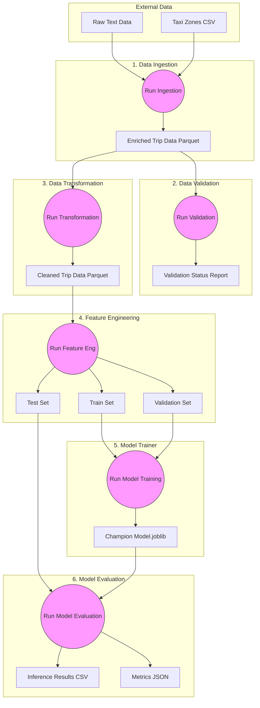

# DVC Pipeline Architecture Report

## 1. Overview
The **NYC Taxi Tips Prediction** pipeline is orchestrated by Data Version Control (DVC).
It defines a Directed Acyclic Graph (DAG) ensuring that:
1.  **Reproducibility**: Every artifact is tied to a specific Git commit and code version.
2.  **Efficiency**: Stages are re-run `ONLY` if their dependencies (code or data) change.
3.  **Traceability**: The lineage of every model is fully auditable.

## 2. Pipeline DAG
The pipeline consists of 5 primary stages (currently implemented):



## 3. Detailed Stage Breakdown

### 3.1 Data Ingestion (`stage_01_data_ingestion`)
*   **Input**: Raw Distilled Trip Records (`.txt`), Taxi Zones (`.csv`).
*   **Logic**: Joins trip data with zone names, handles basic schema enforcement.
*   **Output**: `artifacts/data_ingestion/enriched_trip_data.parquet`.
*   **Dependency**: `src/components/data_ingestion.py`.

### 3.2 Data Validation (`stage_02_data_validation`)
*   **Input**: Enriched Data (`.parquet`).
*   **Logic**: Validates schema against `config/schema.yaml`. Checks for critical column existence.
*   **Output**: `artifacts/data_validation/status.txt`.
*   **Dependency**: `src/components/data_validation.py`.
*   **Note**: This stage is a "Gatekeeper". If it fails, the pipeline halts.

### 3.3 Data Transformation (`stage_03_data_transformation`)
*   **Input**: Enriched Data (`.parquet`).
*   **Logic**:
    *   **Imputation**: Fills nulls in `airport_fee`, `congestion_surcharge`, `passenger_count`.
    *   **Filtering**: Prunes negative fares, invalid distances, and outliers.
*   **Output**: `artifacts/data_transformation/cleaned_trip_data.parquet`.
*   **Dependency**: `src/components/data_transformation.py`.

### 3.4 Feature Engineering (`stage_04_feature_engineering`)
*   **Input**: Cleaned Data (`.parquet`).
*   **Logic**:
    *   **Cyclical Encoding**: Transforms Hour/Day/Month into Sin/Cos pairs.
    *   **Temporal Splitting**: Splits data by month (Jan-Aug/Sept-Oct/Nov-Dec).
*   **Outputs**:
    *   `artifacts/feature_engineering/train.parquet`
    *   `artifacts/feature_engineering/val.parquet`
    *   `artifacts/feature_engineering/test.parquet`
*   **Dependency**: `src/components/feature_engineering.py`.

### 3.5 Model Trainer (`stage_05_model_trainer`)
*   **Input**: Training and Validation Set (`.parquet`).
*   **Logic**:
    *   **Subsampling**: Fast local training toggle.
    *   **Model Benchmarking**: Trains multiple candidates (XGBoost, RandomForest, Ridge, etc.).
    *   **Selection**: Multi-metric weighted scoring on Validation Set.
*   **Outputs**:
    *   `artifacts/model_trainer/model.joblib` (Best Model)
*   **Tracking**: Integrated with **MLflow** for experiment tracking and model registration.
*   **Dependency**: `src/components/model_trainer.py`.

### 3.6 Model Evaluation (`stage_06_model_evaluation`)
*   **Input**: Test Set (`.parquet`) and Champion Model (`.joblib`).
*   **Logic**:
    *   **Evaluation**: Calculates MAE, MSE, and R² against the hold-out test set to get final real-world performance metrics.
    *   **Inference**: Generates predictions on the test set, simulating a batch incoming data load.
*   **Outputs**:
    *   `artifacts/predictions/inference_results.csv`
    *   `artifacts/model_evaluation/metrics.json`
*   **Tracking**: Test metrics logged directly to the MLflow experiment.
*   **Dependency**: `src/components/model_evaluation.py`, `src/components/predict_model.py`.

## 4. Execution
To reproduce the entire pipeline (or only what changed):
```bash
uv run dvc repro
```

To visualize the DAG in terminal:
```bash
uv run dvc dag
```
