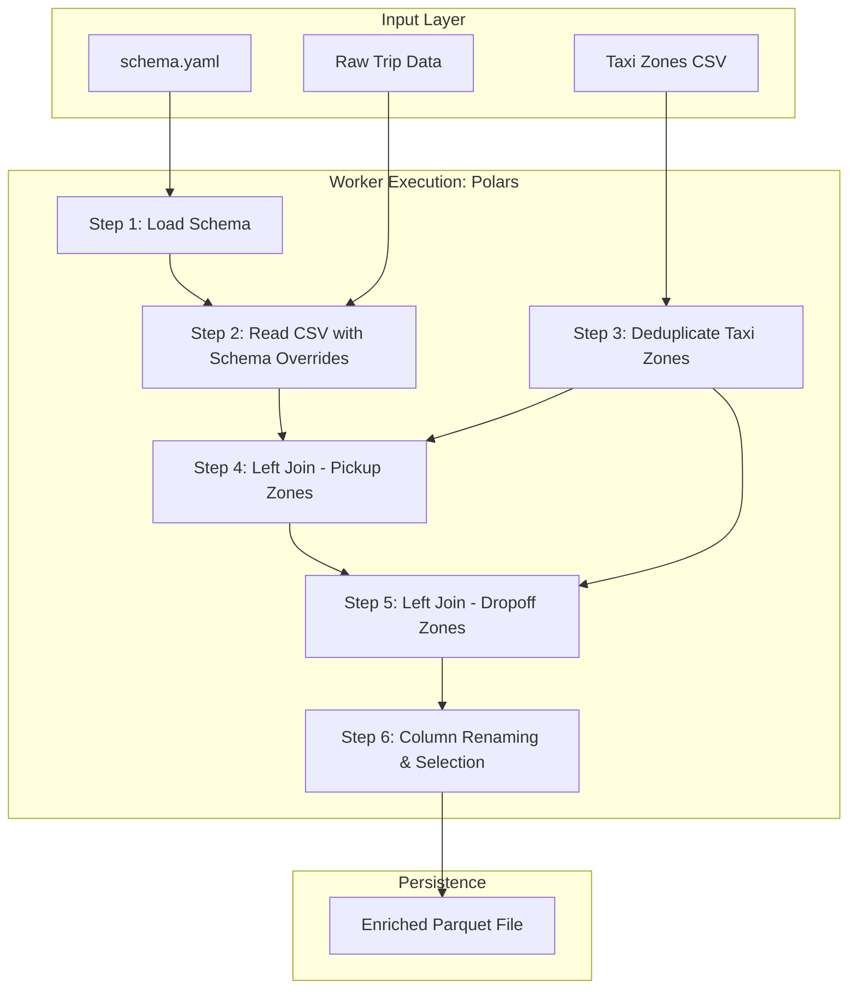

# Data Ingestion Report: NYC Taxi Tips Prediction

## 1. Overview
The **Data Ingestion** stage is the first step in the NYC Taxi Tips Prediction pipeline. Its primary objective is to load raw taxi trip data, enforce a standardized schema, and enrich the dataset with geographical metadata (Borough and Zone names) using a reference lookup table.

## 2. Architecture: Conductor-Worker Pattern
The ingestion process follows a modular architecture to separate orchestration logic from technical execution:

*   **Conductor (`src/pipeline/stage_01_data_ingestion.py`)**: Responsible for fetching configurations via the `ConfigurationManager` and initiating the pipeline stage.
*   **Worker (`src/components/data_ingestion.py`)**: Contains the high-performance logic using **Polars** for reading, joining, and writing data.

### Detailed Workflow Diagram
The process follows a strictly linear, deterministic sequence to ensure data quality at every node:

## 3. Why this is "Robust MLOps"
This implementation adheres to industrialized standards that differentiate a "script" from a "production pipeline":

*   **Deterministic Contract (Schema-First)**: By centralizing types in `schema.yaml` and enforcing them via Polars' `schema_overrides` during `read_csv`, we prevent silent data drift. This ensures that any unexpected type changes in the source data are either explicitly cast or trigger an immediate failure at the I/O boundary, preventing "poisoned" data from propagating into the feature engineering stage. Eliminating "Column Type Drift" errors before they reach the model
*   **Decoupled Orchestration (Conductor-Worker)**: The separation of `src/pipeline` (logic flow) and `src/components` (execution) allows for independent testing. We can unit test the ingestion logic without needing to trigger the entire pipeline.
*   **High-Volume Performance**: Using **Polars** instead of Pandas allows for multi-threaded data loading and zero-copy memory operations, essential for processing 5M+ records efficiently.
*   **Parquet Standardization**: Saving to Parquet instead of CSV preserves metadata (dtypes) and enables predicate pushdown for future transformation stages, significantly reducing I/O overhead.
*   **Reproducibility via DVC**: The entire stage is treated as a versioned artifact. If the schema or the ingestion logic changes, DVC ensures the downstream training stages are invalidated and re-executed, maintaining the integrity of the experiment.
*   **Graceful Failure (Agentic Readiness)**: The use of `CustomException` and structured logging ensures that if a data file is missing or a schema is violated, the system fails loudly with precise context, allowing for faster automation and "Agentic Healing".

## 4. Data Sources
| Source | Format | Description |
| :--- | :--- | :--- |
| **Distilled Trip Data** | CSV (txt) | 5M rows of yellow taxi trips (timestamps, distance, fares). |
| **Taxi Zones** | CSV | NYC TLC lookup table mapping LocationIDs to Boroughs and Zones. |

## 5. Key Implementation Details

### 5.1. Schema Enforcement
We utilize Polars' `schema_overrides` to ensure strict data types as defined in `config/schema.yaml`. This prevents data drift and ensures consistency across subsequent pipeline stages (Transformation, Training).

### 5.2. Geo-Enrichment (The Join)
The raw trip data only contains numerical IDs for pickup (`PULocationID`) and dropoff (`DOLocationID`). We perform two left-joins against the Taxi Zones reference data to append:
- `PU_Borough`, `PU_Zone`
- `DO_Borough`, `DO_Zone`

### 5.3. Data Integrity
- **Deduplication**: The Taxi Zones reference data is deduplicated by `LocationID` before joining to prevent row explosion.
- **Error Handling**: Custom exception handling wraps the entire process to provide detailed stack traces and logging via `src.utils.exception.CustomException`.

## 6. Outputs
- **Artifact**: `artifacts/data_ingestion/enriched_trip_data.parquet`
- **Format**: Parquet (chosen for its efficient compression and fast I/O performance in analytical workloads).
- **Final Shape**: (5,000,000 rows, 23 columns).

## 7. Reproducibility
The stage is fully tracked by **DVC**. Any changes to the code (`src/components/data_ingestion.py`), configuration (`schema.yaml`), or data sources will trigger a re-run of this stage during `dvc repro`.

---
*Created on: 2026-02-15*
