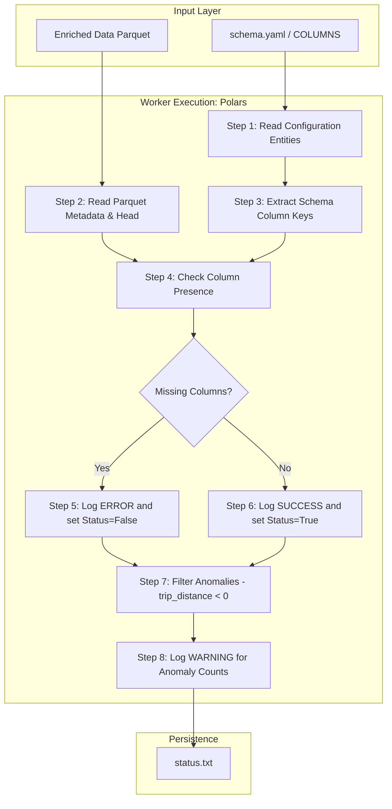

# 02 Data Validation Report: Gatekeeper Architecture

## 1. Overview
The Data Validation stage acts as the primary "Gatekeeper" of the pipeline. Its objective is to ensure that the enriched data produced by the Ingestion stage strictly adheres to the data contract defined in `config/schema.yaml` before any compute-intensive transformation or training occurs.

## 2. Architecture: The Conductor-Worker Pattern
*   **Conductor (`src/pipeline/stage_02_data_validation.py`)**: Fetches configuration, initializes the `ConfigurationManager`, and triggers the validation process.
*   **Worker (`src/components/data_validation.py`)**: Executes high-performance column checks and business logic "Guardrails" using **Polars**.

### Detailed Workflow Diagram
The validation logic follows a disciplined path to ensure data integrity without unnecessary compute overhead:

## 3. Why this is "Robust MLOps"
*   **Decoupled Schema**: By referencing `schema.yaml`, the code remains agnostic to specific column names. Adding or renaming a column only requires a YAML update.
*   **Non-Blocking Guardrails**: While missing columns trigger a `False` status, logic warnings (like negative distances) are logged without stopping the pipe, allowing data scientists to analyze data quality trends without total pipeline failure.
*   **Traceability**: Every run produces a permanent `status.txt` artifact, which DVC uses to decide if downstream stages (Transformation) should proceed.

## 4. Key Implementation Details
### 4.1. Column Presence Check
The component iterates through the keys in `schema.yaml` and verifies their existence in the loaded Parquet file. Any missing columns are logged as errors.

### 4.2. Business Logic Guardrails
Beyond simple types, we implement "Soft Checks":
- **Trip Distance**: Scans for negative values.
- **Data Shape**: Logs the record count to monitor for unexpected data loss during the join phase.

## 5. Outputs
- **Artifact**: `artifacts/data_validation/status.txt`
- **Content**: A boolean flag (`True`/`False`) indicating the integrity of the dataset.

## 6. Reproducibility
Integrated into `dvc.yaml`. This stage is strictly dependent on:
1.  The enriched data artifact.
2.  The centralized `schema.yaml`.
3.  The validation component code.
