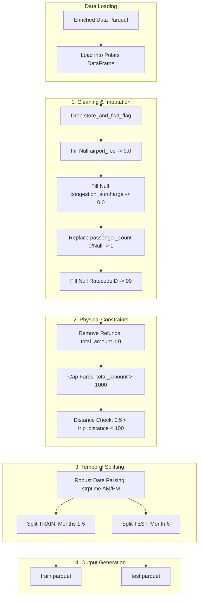

# 03 Data Transformation Report: The "Pruning" System

## 1. Overview
The Data Transformation stage is responsible for converting raw Trip Records into a training-ready Feature Set. It implements rigorous data "pruning" rules (imputation, dropping, and filtering) and executes the project's **Temporal Splitting Strategy** to ensure realistic model evaluation.

## 2. Architecture: The Conductor-Worker Pattern
*   **Conductor (`src/pipeline/stage_03_data_transformation.py`)**: Manages ingestion output paths and triggers the transformation sequence.
*   **Worker (`src/components/data_transformation.py`)**: Implements the technical cleaning logic and datetime-based splitting using **Polars**.

### Detailed Workflow Diagram
The transformation stage is designed as a linear set of deterministic operations to maximize data quality:



## 3. Why this is "Robust MLOps"
*   **FTI Architecture Compliance**: This stage enforces the "Feature" boundary. By saving as Parquet, we maintain metadata integrity across the train/test split.
*   **Temporal Integrity**: We avoid the common pitfall of random `train_test_split`. By training on the past (Jan-May) and testing on the future (June), we simulate how the model will perform on upcoming taxi trips.
*   **Handling Ambiguous Dates**: The implementation uses strict string-to-datetime parsing (`strptime`) to handle complex 12-hour formats (AM/PM) that often break default automated loaders.

## 4. Key Implementation Details

### 4.1. Imputation and Filling Strategy

- **Financials**:
    • Airport Fee (`airport_fee`) and Congestion Surcharge (`congestion_surcharge`): These were filled with `0.0`. The logic used was that if these fees were missing, it likely meant no fee was charged or the cost was zero.

- **Entities**:
    • Passenger Count (`passenger_count`): This was filled with 1. While the average passenger count was approximately 1.37, the source noted that fractional passengers are impossible. Therefore, the missing values were filled with 1 rather than the mathematical average.

    • RatecodeID (`RatecodeID`): These were filled with `99` (Unknown). After investigating the data dictionary (`references\data_dictionary_trip_records_yellow.pdf`), it was determined that "99" is the designated code for an "unknown" rate, fitting the situation perfectly.

- **Other**:
    • Store and Forward Flag (`store_and_fwd_flag`): This column was dropped entirely. An investigation revealed this flag merely indicated whether the trip record was held in vehicle memory before being sent to the vendor. It was determined to have zero impact on the tip amount, so the column was removed from the dataset.

### 4.2. Filtering Guardrails
The dataset is pruned of non-physical records:
- **Refunds**: Rows with `total_amount < 0` are removed.
- **Outliers**: Trips > 100 miles or Fares > $1000 are dropped to prevent gradient explosion in the XGBoost model.

### 4.3. Robust Date Parsing
A critical fix was implemented to handle the source date format:
```python
df.with_columns(
    pl.col("tpep_pickup_datetime")
    .str.strptime(pl.Datetime, "%m/%d/%Y %I:%M:%S %p", strict=False)
)
```
This ensures that the temporal split is accurate despite varied locale settings in the source data.

## 5. Outputs
- **Training Set**: `artifacts/data_transformation/train.parquet` (Jan-May 2023)
- **Testing Set**: `artifacts/data_transformation/test.parquet` (June 2023)

## 6. Reproducibility
The stage is dependent on:
1.  Ingestion output (`enriched_trip_data.parquet`).
2.  Date parsing logic and business rules defined in `src/components/data_transformation.py`.
3.  Orchestrated by DVC for automatic invalidation if rules change.
