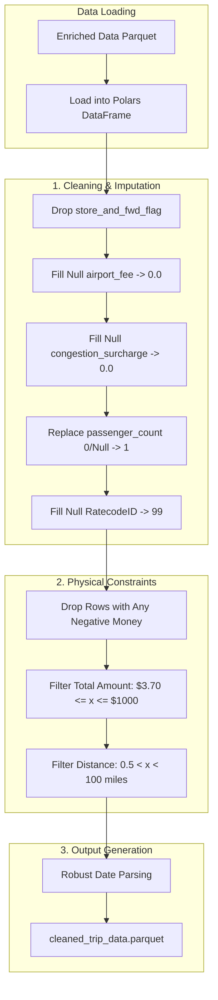

# 03 Data Transformation Report: The Cleaning System

## 1. Overview
The Data Transformation stage is dedicated to converting raw, enriched trip records into a clean, trustworthy dataset. It rigorously applies business logic to filter out anomalies, ensuring that downstream models are not trained on invalid transaction data (e.g., negative fares or impossible distances).

## 2. Architecture: The Conductor-Worker Pattern
*   **Conductor (`src/pipeline/stage_03_data_transformation.py`)**: Orchestrates the transformation job.
*   **Worker (`src/components/data_transformation.py`)**: Uses **Polars** to execute high-performance cleaning and imputation tasks.

### Detailed Workflow Diagram
The transformation stage is a linear validation pipeline:

## 3. Why this is "Robust MLOps"
*   **Garbage In, Garbage Out Prevention**: By enforcing strict physical constraints (e.g., minimum fare $3.70), we prevent the model from learning from refund transactions or system errors.
*   **Standardized Output**: The stage produces a single, validated artifact (`cleaned_trip_data.parquet`) that serves as the "Gold Standard" dataset for all subsequent experiements.
*   **Auditable Logic**: Every filtering decision is logged, providing transparency into how many records were dropped and why.

## 4. Key Implementation Details

### 4.1. Imputation and Filling Strategy

- **Financials**:
    • Airport Fee (`airport_fee`) and Congestion Surcharge (`congestion_surcharge`): These were filled with `0.0`. The logic used was that if these fees were missing, it likely meant no fee was charged or the cost was zero.

- **Entities**:
    • Passenger Count (`passenger_count`): This was filled with 1. While the average passenger count was approximately 1.37, the source noted that fractional passengers are impossible. Therefore, the missing values were filled with 1 rather than the mathematical average.

    • RatecodeID (`RatecodeID`): These were filled with `99` (Unknown). After investigating the data dictionary (`references\data_dictionary_trip_records_yellow.pdf`), it was determined that "99" is the designated code for an "unknown" rate, fitting the situation perfectly.

- **Other**:
    • Store and Forward Flag (`store_and_fwd_flag`): This column was dropped entirely. An investigation revealed this flag merely indicated whether the trip record was held in vehicle memory before being sent to the vendor. It was determined to have zero impact on the tip amount, so the column was removed from the dataset.

### 4.2. Rigorous Filtering Rules
We apply strict "sanity checks" to the data:
1.  **Start Date**: `tpep_pickup_datetime` >= `2023-01-01` (Ensure 2023 data only).
2.  **Negative Value Check**: The dataset contains transactions with negative values, which were identified as refunds or errors where it appeared the passenger was charging the driver rather than paying for a service.
    - Any record with a negative value in ANY financial column (fare, tax, tip, etc.) is dropped. This removes refunds and disputed charges retaining only the valid positive charges.
3. **Total Amount**: This column (`total_amount`) contains significant anomalies at both the high and low ends, which can be handl using specific value filters.
    - **The Anomalies**:
        - **Low End**: The data showed minimum total amounts of $0, which is impossible given that the base fare for a customized cab is $3.00 before the meter even starts; anything less is inconsistent with NYC taxi rules.
        - **High End**: The data contains extreme outliers, including a maximum total amount of approximately $386,000 for a single trip, which is unrealistic.
    - **The Solution (Filters)**: To fix these entry errors, the following logic was applied to keep only reasonable transaction amounts:
        - **Minimum Fare**: Filter the rows to keep only total amounts of at least `$3.70`. This figure was derived by adding the $3.00 base fare to the approximate cost of the minimum distance trip (0.5 miles).
        - **Maximum Fare**: Filter the rows to keep only total amounts under `$1,000`. This threshold was chosen to be "extra generous" to accommodate large tips while removing the massive six-figure outliers or data entry errors.
4.  **Trip Distance (Outliers)**: The data include extreme outliers, such as trips with 0 miles (likely stationary parking) and a trip of 350,000 miles (roughly 14 times the circumference of the Earth).
    - **The Solution (Filters)**: To fix these entry errors, the following logic was applied to keep only realistic taxi trips: `0.5 miles < trip_distance < 100 miles`. Removes zero-distance trips (cancelled) and impossible long-distance errors.

### 4.3. Robust Date Parsing
We apply strict format parsing to handle AM/PM formats correctly, ensuring valid datetime objects for feature engineering.

## 5. Outputs
- **Cleaned Dataset**: `artifacts/data_transformation/cleaned_trip_data.parquet`

## 6. Reproducibility
The stage is dependent on:
1.  Ingestion output (`enriched_trip_data.parquet`).
2.  Date parsing logic and business rules defined in `src/components/data_transformation.py`.
3.  Orchestrated by DVC for automatic invalidation if rules change.
