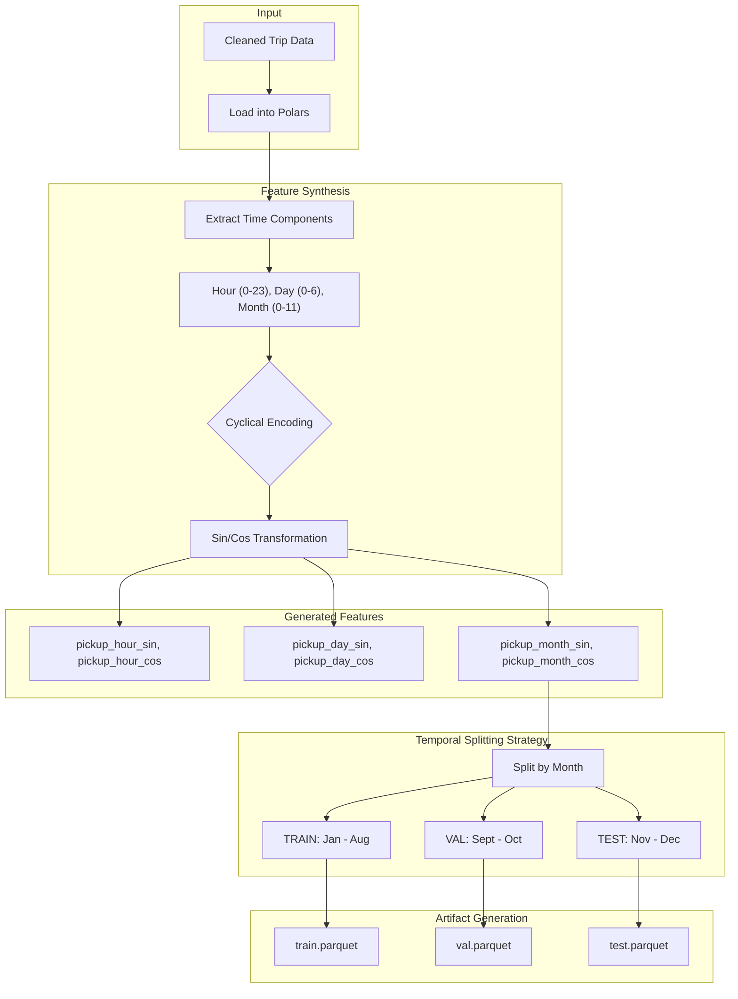

# 04 Feature Engineering Report: The "Brain" Prep

## 1. Overview
The Feature Engineering stage transforms the cleaned, raw trip data into a mathematically robust format suitable for Machine Learning. Its primary goals are to:
1.  **Encode Cyclic Time**: Convert linear time features (Hour 0-23) into cyclical geometric features (Sine/Cosine), preventing model discontinuity at midnight.
2.  **Execute Temporal Splitting**: Divide the dataset into Training, Validation, and Testing sets based on strict temporal boundaries to prevent data leakage.

## 2. Architecture

*   **Conductor (`src/pipeline/stage_04_feature_engineering.py`)**: Triggers the feature engineering process.
*   **Worker (`src/components/feature_engineering.py`)**: Implements the mathematical transformations and splitting logic using **Polars** and **NumPy**.

### Workflow Diagram

## 3. Key Implementation Details

### 3.1. Cyclical Time Encoding
Machine Learning models (like XGBoost or Linear Regression) interpret numerical inputs linearly. This creates a problem for time:
*   **The Problem**: To a model, Hour 23 (11 PM) and Hour 0 (12 AM) are far apart (distance = 23). In reality, they are adjacent.
*   **The Solution**: We map time onto a unit circle using Sine and Cosine transformations.
    *   `pickup_hour_sin = sin(2 * pi * hour / 24)`
    *   `pickup_hour_cos = cos(2 * pi * hour / 24)`
    *   This ensures that 23:59 is mathematically close to 00:01.

We apply this technique to:
*   **Hour of Day** (Influence of rush hour vs. late night)
*   **Day of Week** (Weekday vs. Weekend patterns)
*   **Month of Year** (Seasonality)

### 3.2. Three-Way Temporal Split
To realistically evaluate our model, we simulate a production environment where we train on past data and predict the future. We strictly avoid random splitting.

*   **Training Set (Jan - Aug)**: Used to teach the model patterns.
*   **Validation Set (Sept - Oct)**: Used for hyperparameter tuning and early stopping.
*   **Testing Set (Nov - Dec)**: Used for the final "hold-out" evaluation locally.

**Why this matters**: Random splitting would allow the model to learn from "future" trips in the same month, leaking information about traffic or weather conditions that it shouldn't know.

## 4. Outputs
- **Training Set**: `artifacts/feature_engineering/train.parquet`
- **Validation Set**: `artifacts/feature_engineering/val.parquet`
- **Testing Set**: `artifacts/feature_engineering/test.parquet`

## 5. Scaling & Performance
*   **Polars**: All transformations are vectorized and executed in Polars, allowing for processing millions of rows in seconds.
*   **Parquet**: Data is saved in columnar format to optimize I/O for the subsequent training stage.
