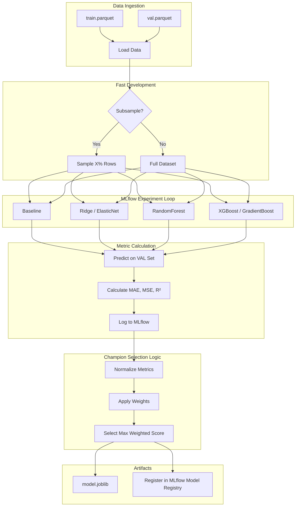

# 05 Model Trainer Report: The "Selection" Arena

## 1. Overview
The Model Trainer stage is the competitive core of the pipeline. Its primary objective is to evaluate multiple candidate regression models, track their performance transparently using **MLflow**, and select a "Champion" model based on weighted business and technical metrics.

Key innovations in this stage include:
1.  **Multi-Model Benchmarking**: Running Baseline, Linear, Tree-based, and Boosting models simultaneously.
2.  **Weighted Multi-Metric Selection**: Selecting the best model using a configurable combination of MAE, MSE, and R².
3.  **Fast Iteration Mode**: Built-in subsampling for rapid local testing without processing millions of rows.
4.  **Anti-Leakage Strategy**: Using the **Validation Set** for selection, preserving the Test Set for unbiased evaluation.

## 2. Architecture

*   **Conductor (`src/pipeline/stage_05_model_trainer.py`)**: Manages the pipeline lifecycle and error handling.
*   **Worker (`src/components/model_trainer.py`)**: Orchestrates the training loops, metric calculation, and MLflow logging.

### Workflow Diagram



## 3. Key Implementation Details

### 3.1. Multi-Metric Weighted Scoring
Instead of relying on a single metric, we use a normalized weighted score defined in `params.yaml`.

*   **Normalization**: Since MAE (dollars) and R² (percentage) have different scales, we apply **Min-Max Normalization** across all candidate models for each metric.
*   **Polarity Handling**: The system understands that for **MAE** and **MSE**, lower is better (distances are inverted), while for **R²** higher is better.
*   **Weighted Sum**: The final score is computed as:
    $$\text{Final Score} = \sum (\text{normalized\_metric}_i \times \text{weight}_i)$$

### 3.2. Fast Local Development (Subsampling)
To avoid the overhead of training on 5+ million rows during development, we introduced the `subsample_fraction` parameter.
*   Located in `config/params.yaml`.
*   Setting it to `0.01` allows the pipeline to complete in **~90 seconds** while still verifying the entire infrastructure.

### 3.3. MLflow Integration & Tracking
Every model run is logged to a local or remote MLflow server:
*   **Parameters**: Hyperparameters for each algorithm.
*   **Metrics**: Validation performance.
*   **Models**: Serialized model files (pickled or XGBoost binary).
*   **Registry**: The champion is automatically registered as `nyc-taxi-tips-champion`.

## 4. Configuration Highlights

### `params.yaml` (Excerpts)
```yaml
Training:
  subsample_fraction: 1.0  # Set to 0.01 for fast runs
  selection_metrics:
    mae: 0.7               # Focus on minimizing error
    mse: 0.2
    r2: 0.1                # Minor focus on variance
```

### `config.yaml`
```yaml
model_trainer:
  train_data_path: artifacts/feature_engineering/train.parquet
  val_data_path: artifacts/feature_engineering/val.parquet
  model_name: model.joblib
```

## 5. Selection Integrity
By evaluating on `val.parquet` instead of `test.parquet`, we ensure that the hyperparameters and model selection choices are justified by validation data. The `test.parquet` remains a "dark set" that is only used in the final evaluation stage to report real-world performance expectations.

## 6. Outputs
- **Local Model**: `artifacts/model_trainer/model.joblib`
- **MLflow Version**: Automatically registered in the Model Registry.
- **Tracking Logs**: Viewable via `uv run mlflow ui`.
