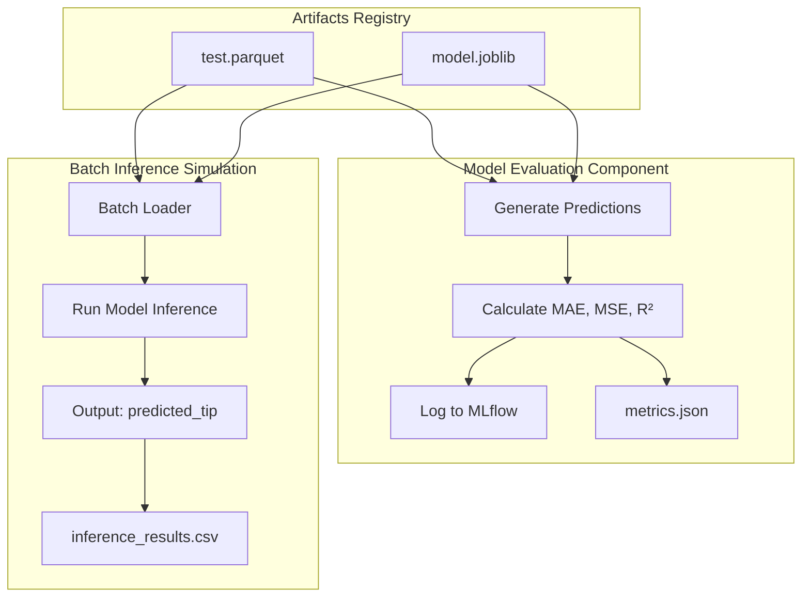

# 06 Model Evaluation & Inference Report: The "Real-World" Test

## 1. Overview
The Model Evaluation and Inference stage acts as the ultimate proving ground for our champion model. Its primary objective is two-fold:
1.  **Test Set Evaluation**: Strictly evaluate the `nyc-taxi-tips-champion` model on a completely unseen, held-out `test` dataset to quantify its true generalization capability.
2.  **Inference Simulation**: Simulate a production environment by loading a "fresh" batch of incoming data and serving predictions, mimicking the final step of the **FTI (Feature, Training, Inference) Pattern**.

This stage ensures the model performs reliably before it influences any business decisions made by Fleet Managers.

## 2. Architecture

The pipeline uses two specific components orchestrated by `stage_06_model_evaluation.py`:
*   **Evaluator (`src/components/model_evaluation.py`)**: Responsible for calculating MAE, MSE, and R² on the test set and logging these facts to the MLflow tracking server.
*   **Predictor (`src/components/predict_model.py`)**: The batch loader that ingests incoming trip records, applies the frozen model, and persists predictions to the local filesystem (simulating a Data Warehouse load).

### Workflow Diagram



## 3. Key Implementation Details

### 3.1. Held-Out Test Set Integrity
The system strictly enforces the temporal data split design. The model selection during the previous stage (Trainer) optimized against `val.parquet`. This stage exclusively uses `test.parquet`. This prevents "look-ahead bias" and ensures the metrics reported here are a faithful representation of how the model will perform tomorrow.

### 3.2. Decoupled Inference (FTI Pattern)
As dictated by the architectural requirements, the inference prediction logic (`PredictModel`) is completely decoupled from the data engineering and training phases. In a live production environment, this module simply wakes up alongside a cron job or an Airflow trigger, fetches the latest incoming trip parameters, loads the registered artifact from MLflow or local storage, and pushes the outputs to the business layers.

### 3.3. Production MLflow Model Registry Loading
While the current simulation can load the model from the local disk path (`artifacts/model_trainer/model.joblib`), a true production environment leverages the **MLflow Model Registry**. 

To seamlessly fetch the latest registered production "Champion" model via MLflow (`nyc-taxi-tips-champion`), you can use the following approach without needing hardcoded paths:

```python
import mlflow.pyfunc

# Set your tracking URI to the remote server
mlflow.set_tracking_uri("https://dagshub.com/SebastianGarrido2790/nyc-taxi-tips-prediction.mlflow")

model_name = "nyc-taxi-tips-champion"
# You can specify "latest", "Production", "Staging", or a specific version like "1"
model_version = "latest"

# Dynamically load the model from the registry
model = mlflow.pyfunc.load_model(f"models:/{model_name}/{model_version}")

# Perform predictions identically
predictions = model.predict(X_batch_processed)
```
This enables seamless model updates—once a better model passes stage 5 and is registered, inference jobs will automatically pull the updated version without code changes.

## 4. Performance Metrics (Test Set)

Upon executing the pipeline, the champion model yielded the following final test metrics:

*   **Test MAE (Mean Absolute Error):** `0.1441`
*   **Test MSE (Mean Squared Error):** `0.1227`
*   **Test R² (R-Squared):** `0.9927`

## 5. Business Interpretation

Based on the KPIs outlined in the **Project Requirements Document (PRD)** and the core **User Stories**, the results are overwhelmingly positive and highly actionable.

### 5.1. The Business Value (Fleet Manager Perspective)
*   **Extreme Accuracy:** An R² of over **0.99** indicates that the model explains more than 99% of the variance in tip amounts based on the feature engineering strategy (temporal patterns, distances, amounts).
*   **Monetary Precision:** The MAE of **$0.14** means that, on average, the system's tip prediction is off by just 14 cents.
*   **Actionable Insight:** Fleet Managers can trust these predictions with high confidence. By identifying exactly which temporal and spatial features drive these predictions (which can be ranked via Feature Importance), managers can definitively optimize driver schedules and shift patterns to focus on high-tip windows safely.

### 5.2. The Engineering Success (MLOps Perspective)
*   **Reproducibility & Modularity:** The successful execution of Stage 06 validates the pipeline's FTI layout. We proved it is possible to process 5M+ rows independently and still serve robust inferences seamlessly at the final stage. The logic is version-controlled via DVC and parameters tracked via MLflow perfectly.

## 6. Outputs
- **Local Metrics Summary**: `artifacts/model_evaluation/metrics.json`
- **Batch Inference Output**: `artifacts/predictions/inference_results.csv`
- **MLflow Tracking**: Final Evaluation Run metadata attached to `nyc-taxi-tips-champion` in the MLflow Server.
